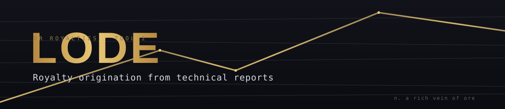
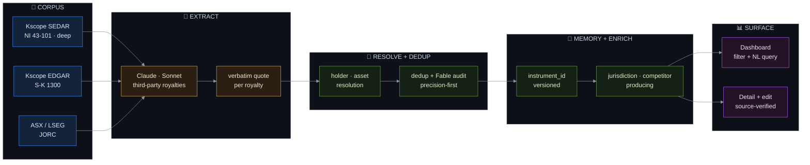
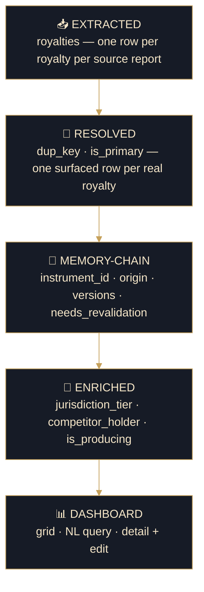
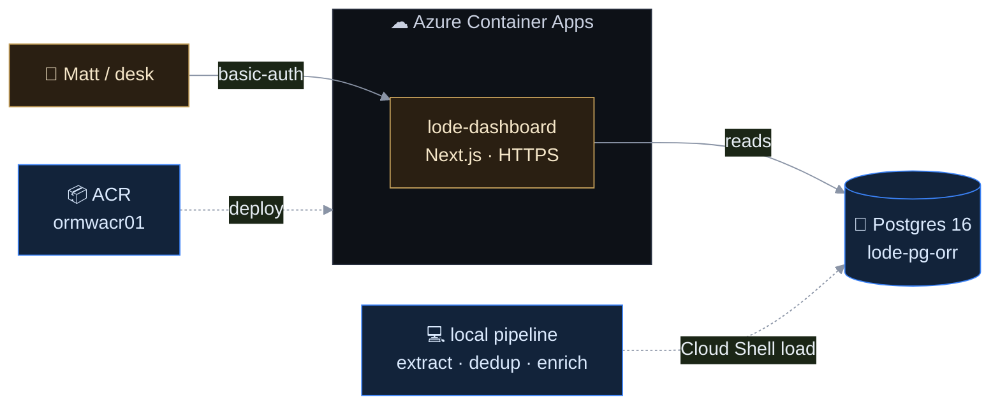

<div align="center">



<br/>

*Reads the technical reports nobody has time to read. Finds every royalty already sitting on the property — held by someone else, and therefore for sale. Verifies each against the exact source sentence. Serves them to the origination desk, filterable and searchable in plain English.*

<br/>


<br/>


</div>

---

## ⛏ The origination pipeline

A 250-page technical report becomes a structured, source-verified, deduplicated royalty on the desk's screen — every royalty carrying the exact sentence that proves it.



<div align="center"><sub><b>corpus → AI reads for royalties → resolve &amp; dedup → version &amp; enrich → surface, source-verified</b></sub></div>

---

## ✦ What it does

- **Finds royalties, not facts.** Claude reads each report for *existing third-party royalties* — an NSR, a stream, an AMR held by a party other than the operator. Those are encumbrances on the property, and therefore acquisition targets. This is origination, not a data-entry tracker.
- **Every royalty is source-verified.** Each one stores the **exact verbatim sentence** from the report — never a paraphrase — so an analyst confirms it against the source, not the model's word. "Instrument description, as stated in source document."
- **Structured features, not free text.** Rate, holder, type, plus a taxonomy — partial coverage, buy-down, sliding scale, **cap** (production *or* revenue threshold), advance payments, ROFR — each extracted as its own field.
- **One row per real royalty.** Precision-first dedup collapses the same royalty re-reported across years and spelling variants, while a genuine royalty *stack* (many holders on one asset) stays distinct. A Fable-5 audit surfaces the near-misses.
- **Remembers, never overwrites.** A memory-chain gives each royalty a stable `instrument_id` with append-only versions — an analyst edit becomes a new version flagged for re-validation, and the history stays visible.
- **Knows the ground.** Every instrument is tagged by jurisdiction tier (Tier-1 or not), whether the holder is a **competitor**, and whether the asset is **producing** — the exact filters an originator screens on.
- **Ask it in English.** "Producing gold in Nevada or Quebec under 2%, held by a competitor" → guardrailed text-to-SQL over the schema, right in the dashboard.

---

## 🛡 The one principle: reviewable ledgers

> Every time an LLM proposes a change — dedup merges, holder/asset resolution, jurisdiction, the Fable-5 audit — it writes a **JSON ledger a human reviews *before* anything touches the database.** The apply step is **non-destructive**: nothing is deleted, `is_primary` is a display flag, and an edit *appends* a version and flags `needs_revalidation`.
>
> **LLM proposes → human reviews → apply.** It's why the numbers can be trusted, and why re-running the pipeline never silently rewrites the desk's work.

---

## 🗄 Architecture

One core table, versioned and enriched. The dashboard only ever reads.



`db/schema.sql` is the source of truth; schema changes are numbered migrations in `db/migrations/` (001–004). Full rationale in [`CLAUDE.md`](CLAUDE.md).

---

## 🧰 The stack

| Layer | Choice |
|---|---|
| **Language** | Python 3.11 (conda `mining_ai`) |
| **Store** | PostgreSQL 16 · single source of truth · local `:5433` / Azure Flexible Server |
| **AI** | Anthropic SDK · **Sonnet 4.6** extraction · **Opus 5** resolvers · **Fable 5** duplicate audit |
| **Documents** | PyMuPDF (report PDF text) · vendored Kscope client · ASX / EDGAR / LSEG adapters |
| **Dashboard** | Next.js 16 · React 19 · Tailwind · `pg` · direct Postgres reads + guardrailed text-to-SQL |
| **Hosting** | Azure Container Apps (mirrors MarketWatch) |
| **Discipline** | reviewable JSON ledgers · non-destructive apply · verbatim source quote per royalty |

---

## 📈 By the numbers

<div align="center">

| | | |
|:--:|:--:|:--:|
| **~700** | **~300** | **1,150** |
| royalty instruments | assets covered | source rows |
| **3** | **4** | **LIVE** |
| Claude model tiers | schema migrations | on Azure |

</div>

---

## 🛰 Live on Azure

One deployed service — the dashboard reads live Postgres behind a preview gate. Extraction and dedup run on demand from `scripts/` under the reviewable-ledger discipline.



**The desk's toolkit** — all live in the dashboard:

| | Feature | What it does |
|:--:|---|---|
| 🔎 | **Natural-language query** | "Producing gold in Nevada under 2%" → guardrailed text-to-SQL over the schema. |
| 🎚 | **Screen filters** | Metal · regime (43-101 / S-K1300 / JORC) · region · **Tier-1** · **Producing** · **Competitor-held**. |
| 📜 | **Source-verified detail** | Every instrument shows its verbatim source sentence + a full feature checklist (dashes where absent, for a consistent read). |
| 🧬 | **Version history** | The memory-chain per instrument — every version, its origin (Claude / human-edited), and what needs re-validation. |
| ✏️ | **Analyst edit** | Correct a holder/rate/etc. in place; the edit appends a version and flags it, never overwriting the source. |

---

## 🚀 Run it

```bash
# Postgres (local, :5433, db=lode)
scripts/pg_local.sh
python scripts/init_db.py                       # apply db/schema.sql

# Dashboard (reads live Postgres) — production mode; dev HMR is flaky in WSL
cd dashboard && conda activate prm_web
npm run build && PORT=3010 npm run start          # → http://localhost:3010
```

<details>
<summary><b>First-time setup + the pipeline (corpus → dashboard)</b></summary>

```bash
conda activate mining_ai
pip install -e .
# .env holds KSCOPE_API_KEY + ANTHROPIC_API_KEY (local only, gitignored)
# portfolio + competitor xlsx are read from $HOME (never committed)

# Run the pipeline in order (each LLM step writes a reviewable ledger to data/ → review → apply):
python scripts/archive_corpus.py          # fetch technical reports → corpus/ + manifest
python scripts/royalty_pilot.py           # Claude extraction → extraction JSON
python scripts/load_royalties.py          # → royalties table
python scripts/resolve_holders.py         # → data/holder_merges.json   (review, then --apply)
python scripts/resolve_assets.py          # → data/asset_aliases.json   (review, then --apply)
python scripts/dedupe.py                  # is_primary + dup_key + instrument_id (re-runnable)
python scripts/audit_dupes_fable.py       # → data/audit_merges.json    (candidates → apply_audit_fixes.py)
python scripts/enrich_jurisdiction.py     # tier   (ledger → --apply)
python scripts/flag_competitors.py        # competitor-held (ledger → --apply)
python scripts/backfill_producing.py      # is_producing from stage (--apply)
```
</details>

Deploy commands + Cloud Shell DB ops: **[`DEPLOY.md`](DEPLOY.md)**.

---

## 🧭 Source reality

Honest about how far back each jurisdiction reaches — named, not papered over.

| Jurisdiction | Report | Source | History |
|---|---|---|:--:|
| Canada (~100) | NI 43-101 | Kscope SEDAR | ✅ deep |
| US (~30) | S-K 1300 | Kscope EDGAR | ✅ |
| Australia (~18) | JORC | ASX free API | ⚠️ forward-only |
| JSE / China / private | SAMREC / other / — | — | ❌ no auto-source |

The **AU-history gap** is the one place LSEG (ASX + history) or manual entry would return — a scoped gap, flagged to the desk.

---

## 🗺 Repo map

<details>
<summary><b>Expand</b></summary>

```
tech_report_db/
├── CLAUDE.md                  ← project decisions (read first)
├── README.md                  ← you are here
├── DEPLOY.md                  ← push-to-prod + DB ops
├── db/
│   ├── schema.sql             ← canonical DDL
│   └── migrations/            ← 001 jurisdiction · 002 competitor · 003 memory-chain · 004 producing
├── src/techreport/
│   ├── royalty.py             ← Claude royalty extraction (model + prompt)
│   ├── resolve.py             ← holder / asset / operator resolution
│   ├── archive.py             ← corpus fetch; asx_jorc · edgar · lseg adapters
│   ├── portfolio.py           ← the OR portfolio; overrides.py manual corrections
│   └── db.py · config.py
├── scripts/                   ← the pipeline as runnable steps + reviewable-ledger apply scripts
├── dashboard/                 ← Next.js: app/board.tsx (grid + detail) · lib/queries.ts · app/actions.ts (edits)
├── corpus/ · data/            ← reports + LLM ledgers — gitignored (big + confidential)
└── docs/                      ← specs + Matt-feedback notes
```
</details>

---

## ☁ What's next

- **Confirm the competitor list** with Matt, then re-run flagging against the current file.
- **Two new commodity-specific features + area-of-interest** — pending Matt's confirm + a re-extraction.
- **Memory-chain review** (`docs/specs/memory_chain.md`) + the 3 held dedup merges + null-holder attribution.
- **The parked tech-report tracker** (resources / reserves / economics) — still waiting on Matt's field list.
- **Migrate to the org** (`OR-Royalties-Inc`), like MarketWatch — a clean mirror-push from here.

---

<div align="center">
<sub><b>LODE</b> · royalty-origination tooling for OR Royalties · internal, not for distribution</sub>
</div>
